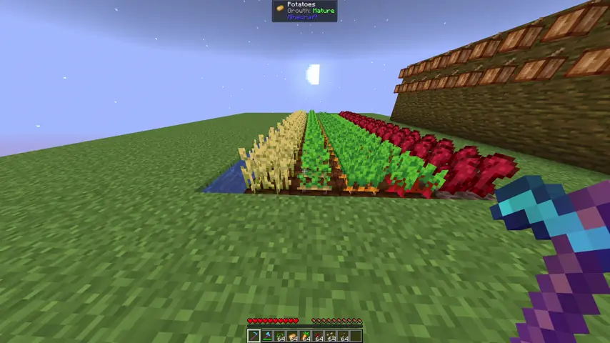

# Replenish++ 🌾

Auto-replant plugin for Paper/Purpur. You break a crop, it goes back in the ground. That's basically it. Stole the idea from Hypixel's Replenish because I got tired of replanting by hand.



## What it does

- Replants Wheat, Carrots, Potatoes, Nether Wart, Cocoa, and Beetroots automatically
- Immature crops stay at whatever growth stage they were at
- Eats a seed from your inventory on mature harvest (can turn this off)
- Can pipe drops straight into your inventory instead of the ground (also toggleable)
- You actually need the right tool in hand. No hoe, no replant. Cocoa needs an axe.
- Cocoa gets replanted facing the right direction, which was annoying to get right
- Fortune works like normal
- Sounds are fully configurable, or you can just mute them all
- Built to not choke on big farms. There's a per-tick replant cap you can tune.

## Install

1. JAR goes in `plugins/`
2. Start the server
3. Poke at `plugins/Replenish/config.yml` if you want
4. You're done

## What happens by default (no config changes)

**Mature crop:**
- Replants at age 0
- Takes 1 seed from your inventory/off-hand (if `requirePlayerSeed` is on)
- Drops go to you directly (if `directPickup` is on)

**Immature crop:**
- Replants at the same age it was. No seed needed.

---

## Commands & permissions

| Command              | What it does     |
|----------------------|------------------|
| `/replenish status`  | Current settings |
| `/replenish version` | Plugin version   |
| `/replenish toggle`  | On/off switch    |
| `/replenish reload`  | Reload config    |

Permissions:

- `replenish.status` - everyone
- `replenish.version` - everyone
- `replenish.use` - op
- `replenish.toggle` - op
- `replenish.reload` - op
- `replenish.*` - op

## Config

The stuff you'll probably touch:

```yaml
enabled: true
requirePlayerSeed: true
directPickup: true
replantDelayTicks: 1
maxReplantsPerTick: 1024
checkUpdates: true
```

<details>
<summary>Full default config.yml</summary>

```yaml
# ============================================
#             REPLENISH++ CONFIG
# ============================================

# --------------------------
# GENERAL SETTINGS
# --------------------------

config-version: 6              # don't touch this

enabled: true                  # false = no replanting
requirePlayerSeed: true        # eat 1 seed on mature harvest
directPickup: true             # drops go to you, not the ground
replantDelayTicks: 1           # 1 tick = 50ms

maxReplantsPerTick: 1024      # maximum crops replanted per tick (20 ticks/second)
                              # raise this on beefier servers if replants lag behind
                              # lower it on weaker servers to reduce load

checkUpdates: true             # check GitHub for new releases on server startup

# --------------------------
# CROP TOGGLES
# --------------------------

crops:
  wheat: true
  carrots: true
  potatoes: true
  nether_wart: true
  cocoa: true
  beetroots: true

# --------------------------
# CHAT MESSAGES
# --------------------------
# Placeholders: {crop}, {tool}, {seed}, {count}
# Docs: https://docs.advntr.dev/minimessage/format.html

messages:
  inventory-full: "<dark_gray>[<yellow>Replenish<dark_gray>] <dark_gray>» <gray>Your inventory was full, so some items dropped on the ground instead."
  requires-tool: "<dark_gray>[<yellow>Replenish<dark_gray>] <dark_gray>» <gray>You need a <yellow>{tool} <gray>to harvest <yellow>{crop}<gray>."
  need-seed: "<dark_gray>[<yellow>Replenish<dark_gray>] <dark_gray>» <gray>You need <yellow>{count}x {seed} <gray>in your inventory to replant this."

# --------------------------
# SOUND EFFECTS
# --------------------------
# Docs: https://jd.papermc.io/paper/org/bukkit/Sound.html
#         Invalid names log a warning and fall back to the default.
# volume: 0.0 (silent) to 1.0 (loudest)
# pitch:  0.5 (low) to 2.0 (high); 1.0 = normal
#
# To disable a sound entirely, set enabled: false.

sounds:
  # Played when harvested crops go into your inventory
  pickup:
    enabled: true
    sound: ENTITY_ITEM_PICKUP
    volume: 1.0
    pitch: 1.0

  # Played when your inventory is full and items drop on the ground
  inventory-full:
    enabled: true
    sound: BLOCK_NOTE_BLOCK_BASS
    volume: 1.0
    pitch: 0.5

  # Played when you try to harvest without the required tool
  denied-tool:
    enabled: true
    sound: ENTITY_VILLAGER_NO
    volume: 1.0
    pitch: 0.5

  # Played when you try to harvest but lack a seed to replant
  denied-seed:
    enabled: true
    sound: ENTITY_VILLAGER_NO
    volume: 1.0
    pitch: 0.5
```

</details>

## Contributions

PRs are disabled on this repo, not because I don't want your help but because managing them gets overwhelming, and I'd rather not ghost people. Open an issue instead, feature ideas, bugs, optimizations, whatever. We'll talk it out there.

That said, fork it, clone it, tear it apart, rebuild it weird. Make the thing *you* want to make. Everyone starts somewhere and you're goated. Go start now.

## License

This project is licensed under the [GNU Affero General Public License v3.0](LICENSE).
